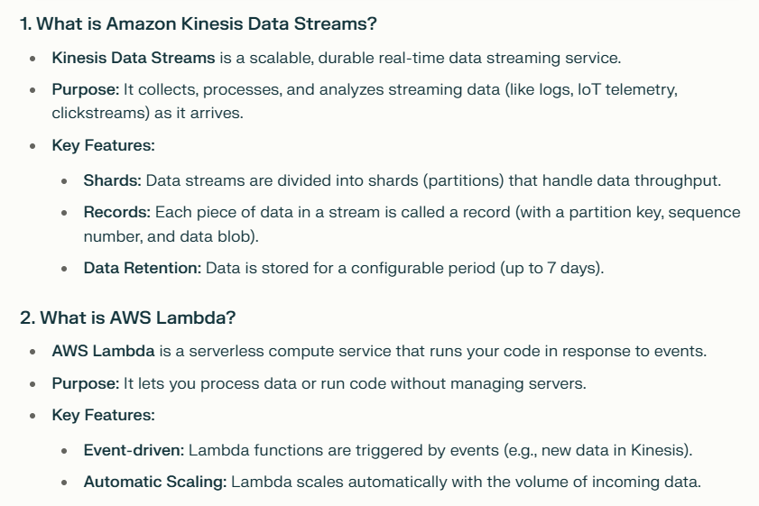

Lambda with Kinesis Data Streams lets you process streaming data in real time, with automatic scaling and minimal setup. You write code to process data, and AWS handles the rest—polling, batching, retries, and checkpointing



https://docs.amazonaws.cn/en_us/lambda/latest/dg/with-kinesis-example.html

1. Create a role for the lambda function
   - 1.1 Look for Access managemet in IAM / roles
   - 1.2 create a role for the lambda function
   - 1.3 we add permission: AWSLambdaKinesisExecutionRole
   - 1.4 set role name: lambda-kinesis-role

2. Create a lambda function.
    - 2.1 set a name
    - 2.2 set the runtime: 3.12 (the version I have used in this project)
    - 2.3 Architecture: x86_64
    - 2.4 Change the default execution role to the one we created in the previous step
    - 2.5 we can write the code of the lambda function in the code editor.
    - 2.6 deploy the function.
    - 2.7 create a new test event.

3. Connect with Kinesis.
    - 3.1 creamos a kinesis data stream.
        - Para la prueba, provisioned, y 1 shard en este caso.
        "Each shard ingests up to 1 MiB/second and 1,000 records/second and emits up to 2 MiB/second. If writes and reads exceed capacity, the application will receive throttles."
        **Es importante borrar el stream cuando ya no se necesite ya que cada hora representa gastos**
    - 3.2 En function overview, podemos añadir un trigger. Ahí es donde conectamos con Kinesis.
        - 3.2.1 En el trigger, seleccionamos el stream que hemos creado.
    - 3.3 Para probar lo que hemos hecho, necesitamos enviar un evento de test al stream, y deberíamos ver a lambda reaccionando al test event.

    ```bash
    KINESIS_STREAM_INPUT=ride-events
    aws kinesis put-record \
        --stream-name ${KINESIS_STREAM_INPUT} \
        --partition-key 1 \
        --data "Hello, this is a test."
    ```
    *we run in (base) where we have installed aws cli*
    *in our case, partition-key will be ride_id, is the way to identify a request*
    *We need to configure a region, in our case eu-west-2. We can do in running aws configure*
    *después de lanzar el comando podemos ver los logs en CloudWatch de Lambda"

    ```bash
    KINESIS_STREAM_INPUT=ride-events
    aws kinesis put-record \
        --stream-name ride-events \
        --partition-key 1 \
        --data "$(echo '{"ride": {"PULocationID": 130, "DOLocationID": 205, "trip_distance": 3.66}, "ride_id": 156}' | base64)"
    ```


